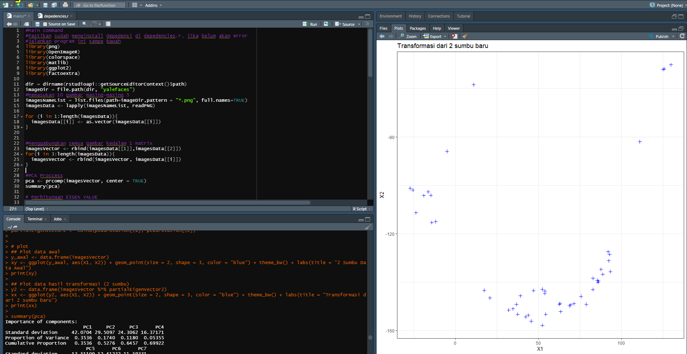

# Tugas-Metkuan

## How to run Tugas 1
#### Pendeknya
Jalanin depedencies.r dulu, habis itu baru jalanin main.r

#### Panjangnya
1. pastikan sudah install git dan github desktop di komputer lu
2. clone repository ini
```
cd "C:/FOLDER/TUGAS/LU"
git clone https://github.com/dafaath/Tugas-Metkuan.git
```
3. Masuk ke folder Tugas 1
4. Buka r studio -> open file main.r dan depedencies.r
5. Jalankan semua kode di depedencies.r `ctrl` + `a` (highlight semua baris) terus `ctrl` + `enter` (run)
6. Bersabar nunggu instalan selesai
7. Jika sudah selesai maka kita bisa menjalankan kode main.r
8. Sama kaya tadi, jalankan semua kode di depedencies.r `ctrl` + `a` (highlight semua baris) terus `ctrl` + `enter` (run)
9. Nanti muncul gambar plot dan output di konsol


