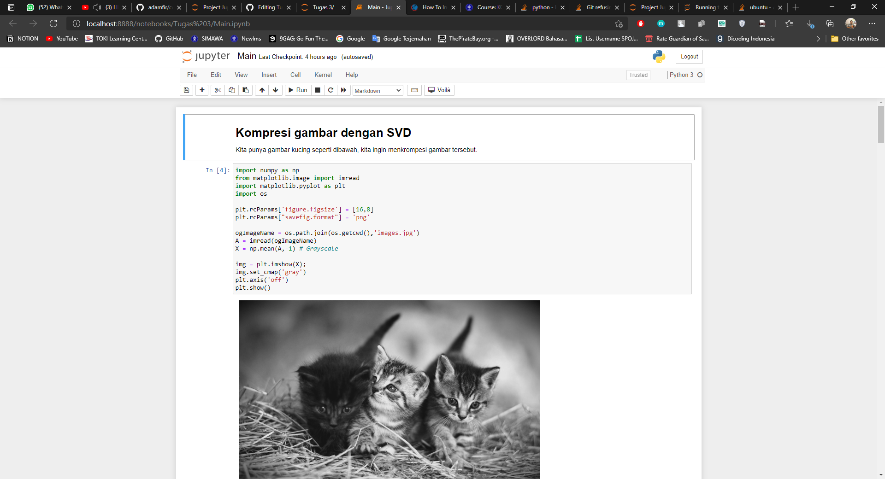

# Tugas-Metkuan

## Laporan
#### Tugas 1
https://docs.google.com/document/d/1WRyAnxlFUlyg-fCLUx1PTzZDn0WbCE1orHGy2HbUfVo/edit?usp=sharing

## How to run Tugas 1
#### Pendeknya
Jalanin depedencies.r dulu, habis itu baru jalanin main.r

#### Panjangnya
1. pastikan sudah install git dan github desktop di komputer lu
2. clone repository ini
```
cd "C:/FOLDER/TUGAS/LU"
git clone https://github.com/dafaath/Tugas-Metkuan.git
```
3. Masuk ke folder Tugas 1
4. Buka r studio -> open file main.r dan depedencies.r
5. Jalankan semua kode di depedencies.r `ctrl` + `a` (highlight semua baris) terus `ctrl` + `enter` (run)
6. Bersabar nunggu instalan selesai
7. Jika sudah selesai maka kita bisa menjalankan kode main.r
8. Sama kaya tadi, jalankan semua kode di depedencies.r `ctrl` + `a` (highlight semua baris) terus `ctrl` + `enter` (run)
9. Nanti muncul gambar plot dan output di konsol


## How to run Tugas 3
#### Pendeknya
install python, pip, dan jupyter notebook

#### Panjangnya
1. pastikan sudah install git dan github desktop di komputer lu
2. clone repository ini
```
cd "C:/FOLDER/TUGAS/LU"
git clone https://github.com/dafaath/Tugas-Metkuan.git
```
3. install python dan pip, [tutorial disini](https://phoenixnap.com/kb/how-to-install-python-3-windows)
4. Setelah melakukan install python dan pip, lakukan command berikut di cmd yang sudah di run as administrator (PENTING!)
```
# Pastikan sudah di folder Tugas-Metkuan
pip install -r requirements.txt
pip install jupyterlab
pip install notebook
pip install voila
```
5. Command diatas akan menginstall jupyter-notebook, untuk menjalankannya lakukan command
```
jupyter notebook
```
6. Buka folder tugas 3 dan buka Main.ipynb
7. Tampilannya seperti dibawah ini


